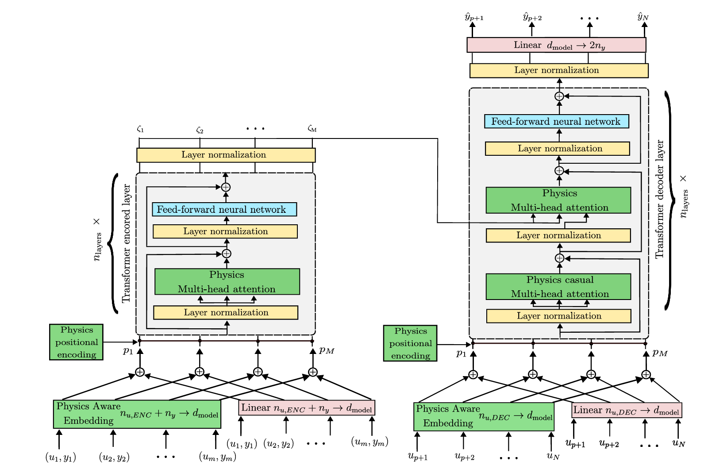

# A Physics-Informed In-Context Learning Framework for Online Interaction Prediction in Robotic Tasks

This is an anomyzied github for the paper "A Physics-Informed In-Context Learning Framework for Online Interaction Prediction in Robotic Tasks".

