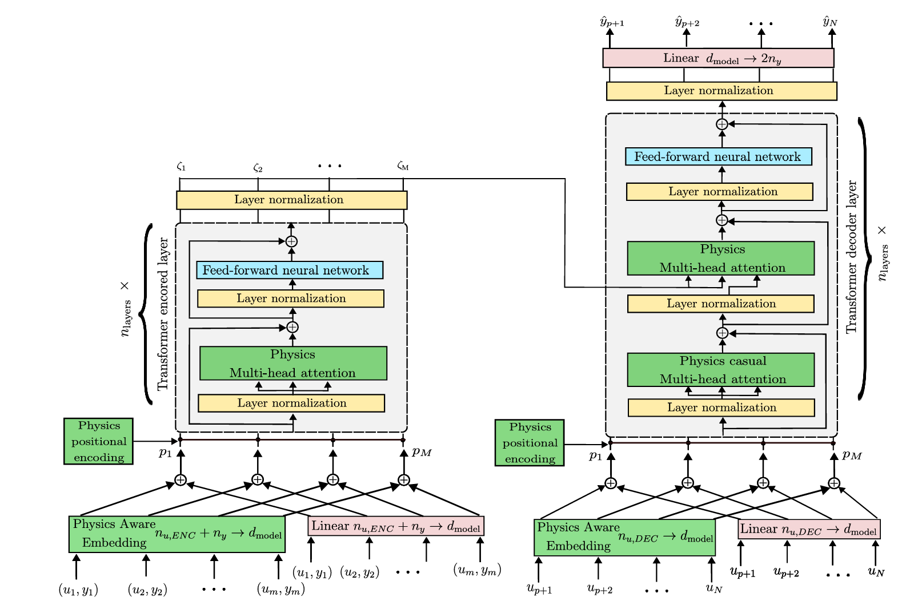

# A Physics-Informed In-Context Learning Framework for Online Interaction Prediction in Robotic Tasks

This is an anomyzied github for the paper "A Physics-Informed In-Context Learning Framework for Online Interaction Prediction in Robotic Tasks".

This framework has been applied to the identification of interaction forces between a robotic arm and its environment. The proposed physics-informed in-context learning solution showed improved generalization when interacting with different environments, of different materials.

**Inputs**:

  - **Cartesian Positions**: (x, y, z),
  - **Cartesian Velocities**: (ẋ, ẏ, ż),
  - **Cartesian Accelerations**: (ẍ, ÿ, z̈),
  - **Cartesian Target positions**: (xₜ, yₜ, zₜ),
  - **Cartesian Target velocities**: (ẋₜ, ẏₜ, żₜ)

**Outputs**:

  - **Interaction Forces**: (Fₓ, Fᵧ, F_z)

This framework has been applied to Panda Franka Robotic Arm.

# Managing training

## [Main paper training](./main_paper_codes/)

-[Physics-informed model training](./main_paper_codes/InteractionMetaModel_Physics_train.py)
-[Data-driven model training](./main_paper_codes/InteractionMetaModel_Data_train.py)

Run any of the codes with the corresponding [datasets](./Datasets/) for the training, which will save a model 'Interaction_metamodel_physics.pth' or 'Interaction_metamodel_data.pth', for the physics-informed or data-driven models, respectively, every 200 epochs. 

# Managing evaluation

## [Main paper evaluation](./main_paper_codes/)

