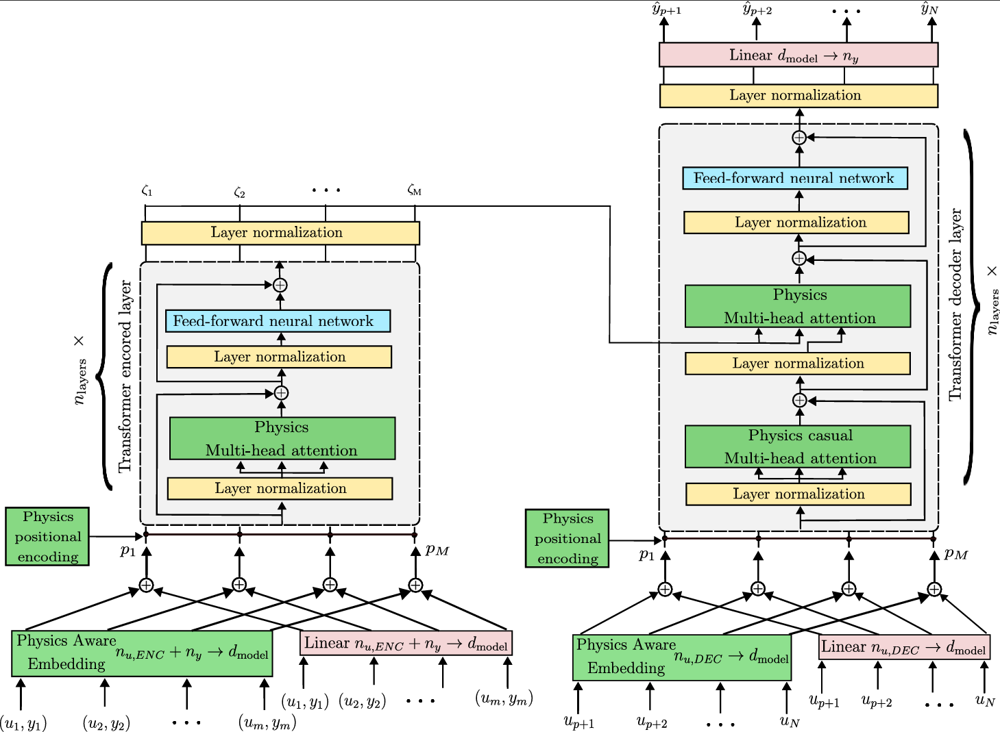

# A Physics-Informed In-Context Learning Framework for Online Interaction Prediction in Robotic Tasks

These are the Python scripts and datasets to train and reproduce the results of the paper "A Physics-Informed In-Context Learning Framework for Online Interaction Prediction in Robotic Tasks". This is an anomyzied github for submission purposes. The introduced approach extends transformer-based meta learning with physically grounded inductive biased, including learnable physics parameters, physics-aware embeddings, and regularization via physics-basedd loss function. The model is trained on real-world interaction datasets collected from a robotic arm executing chirp-like trajectories against different surfaces.

This framework has been applied to the identification of interaction forces between a robotic arm and its environment. The proposed physics-informed in-context learning solution showed improved generalization when interacting with different environments, of different materials.

**Inputs**:

  - **Cartesian Positions**: (x, y, z),
  - **Cartesian Velocities**: (ẋ, ẏ, ż),
  - **Cartesian Accelerations**: (ẍ, ÿ, z̈),
  - **Cartesian Target positions**: (xₜ, yₜ, zₜ),
  - **Cartesian Target velocities**: (ẋₜ, ẏₜ, żₜ)

**Outputs**:

  - **Interaction Forces**: (Fₓ, Fᵧ, F_z)

This framework has been applied to Panda Franka Robotic Arm.

# Managing training

## [Main paper training](./main_paper_codes/)

  - [Physics-informed model training](./main_paper_codes/InteractionMetaModel_Physics_train.py),
  - [Data-driven model training](./main_paper_codes/InteractionMetaModel_Data_train.py)

Run any of the codes with the corresponding [datasets](./Datasets/) for the training, which will save a model 'Interaction_metamodel_physics.pth' or 'Interaction_metamodel_data.pth', for the physics-informed or data-driven models, respectively, every 200 epochs. 

Please note that the models will try to utilize "cuda" if available, if not, the training process may be slow.

# Managing evaluation

## [Main paper evaluation](./main_paper_codes/)

- [Physics-informed model testing](./main_paper_codes/Test_interactionModel_Physics.py)
- [Data-driven model testing](./main_paper_codes/Test_interactionModel_Physics.py)
- [Comparision - main paper](./main_paper_codes/Test_interactionModel_Both.py)

Training scripts will save a checkpoint every 200 epochs, so if you want to evaluate the performances, without waiting for the complete training to end, you can run the "Test" codes on any of the [datasets](./Datasets/). Otherwise, you may find the trained models used in the main paper, in addition to the learned parameters, attached with the appendix in the supplementary folder.

In order to run and compare both models at the same time, resulting in the plots shown in the main paper please consider checking the [comparison code](./main_paper_codes/Test_interactionModel_Both.py).

# Appendix related comparisons

## [Comparison of data-driven acrhitectures](./appendix_codes)

- [Comparison training](./appendix_codes/InteractionMetaModel_Data_train_comparison_architecture.py)
- [Comparison testing](./appendix_codes/Test_interactionModel_comparison_Data_architecture.py)

  This script trains and compares different data-driven architectures as explained in Appendix B. The compared [models](./appendix_codes/DataDriven_interaction_model.py) include the data-driven transformer from the main paper, its decoder-only variant, a standard LSTM, its deeper variant, DeepSets, and a Time Convolutional Network (TCN).

## [Parameter tunining λₚₕᵧₛ](./appendix_codes)

- [Parameter tuning λₚₕᵧₛ](./appendix_codes/InteractionMetaModel_Physics_train_old_fine_tune_lam.py)
- [Parameter testing](appendix_codes/Test_interactionModel_fine_tune_Phy_Lam.py)

This script trains the physics-informed transformer introduced in our paper, with different [λₚₕᵧₛ](./appendix_codes/PITransformer_interaction_model.py), and evaluates the performance of different values with in-distribution and out-of-distribution scenarios, in order to assess the effect of this weight on the model.

# Software requirements

Models were trained and tested in a conda environment utilizing Python 3.12.3 with:

- pandas
- numpy
- pytorch
- wandb
- matplotlib
- scikit-learn
- scipy

Please refer to the official [installation guide](https://www.anaconda.com/docs/tools/working-with-conda/packages/install-packages) to install the mentioned packages in your environment.

# Hardware requirements

While all scripts can run on CPU, execution may be frustratingly slow. For faster training, a GPU is highly recommended. To run the paper's examples, we used a laptop equipped with a Nvidia RTX 4080 GPU.
You can follow the official [CUDA documentation](https://docs.nvidia.com/cuda/index.html) for the installation guide of the cuda-toolkit on your Windows or Linux PC. 

# Robot control requirements

The work was tested on a Franka Emika Panda, using [ROS noetic](https://wiki.ros.org/noetic) on [Ubuntu 20.04](https://wiki.ubuntu.com/FocalFossa/ReleaseNotes).

